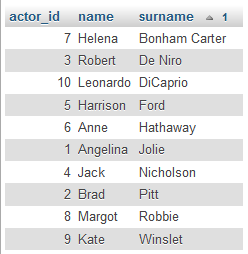

## TASK 6
#### SQL practise, part. II
* Subtask 2 - [Test result](http://getistqb.com/quiz-ecru/)
`12/15`
* Subtask 3 - [Create portfolio](https://github.com/daszkass/Portfolio)
* Subtask 1 - Writing SQL queries
##### 11. Fix the mistake in the Ania's surname - it should be "Miler" not "Muler"
`UPDATE customers SET surname = "Miler" WHERE name = "Ania" `

##### 12. Check the name and email of client with ID 4. Use JOIN function.
`SELECT customers.name, customers.surname, customers.email FROM customers`  
`JOIN sale ON customers.customer_id = sale.customer_id`  
`WHERE sale.movie_id = 4`

##### 13. There is no information about Patrycja's email, fix it.
`UPDATE customers SET email = "pati@mail.com"`  
`WHERE name = "Patrycja" AND email IS NULL`

##### 14. For each purchase display full name of customer and the movie title.
`SELECT CONCAT (customers.name, ' ', customers.surname) AS full_name, movies.title FROM customers`  
`JOIN sale ON customers.customer_id = sale.customer_id`  
`JOIN movies ON sale.movie_id = movies.movie_id`

##### 15. Create nicknames for customers. Add a new "nickname" column and fill it acording to the pattern: two first letters of name and last letter of surname. 
`ALTER TABLE customers ADD nickname varchar (255);`  
`UPDATE customers SET nickname = CONCAT (LEFT(name, 2), RIGHT(surname, 1))`

##### 16. Display list of movie titles, display them so that the titles do not repeat.
`SELECT DISTINCT title FROM movies`

##### 17. Display common list od customers and actors names (use UNION function). Sort the results alphabetically.
`SELECT name FROM customers UNION SELECT name FROM actors`  
`ORDER BY name`

##### 18. Increase the price of all movies produced after 2000 by 2,5
`UPDATE moviesn SET price = price + 2.5`  
`WHERE year_of_production > 2000`

##### 19. Display full name of actor with ID 4 and title of movie, where he played in.
`SELECT actors.name, actors.surname, movies.title FROM actors`  
`JOIN cast ON actors.actor_id = cast.actor_id`  
`JOIN movies ON cast.movie_id = movies.movie_id`  
`WHERE actors.actor_id = 4`
##### 20. Add a new row to the customers table with the following data: ustomer_id = 7, name = Honia, surname = Stuczka-Kucharska, email = honia@mail.com, nickname = Hoa
`INSERT INTO customers VALUES (7, 'Honia', 'Stuczka-Kucharska', 'honia@mail.com', 'Hoa')`

## TASK 5 
#### SQL practise, part. I
* Subtask 1 - learned COMMANDS: `SELECT`, `WHERE`, `ORDER BY`, `LIKE`, `IN`, `IS NULL`, `AND`, `OR`
* Subtask 3 - Writing SQL queries
##### 1. Display the 'actors' table in alphabetical order, sorting by the 'surname' column
`SELECT * FROM actors ORDER BY surname`

##### 2. Display a video that was made in 2019
`SELECT * FROM movies WHERE year_of_production=2019`

##### 3. Display all movies made between 1900 and 1999
`SELECT * FROM movies WHERE year_of_production BETWEEN 1900 AND 1999`

##### 4. Display only the title and price of movies that cost less than $7
`SELECT title, price FROM movies WHERE price<7`

##### 5. Use the logical AND operator to display actors with actor_ids between 4-7 (4 and 7 should display). DO NOT USE BETWEEN operator
`SELECT * FROM actors WHERE actor_id>=4 AND actor_id<=7`

##### 6. Display customers with id 2,4,6, use logical operator for this
`SELECT * FROM customers WHERE customer_id=2 OR customer_id=4 OR customer_id=6`

##### 7. Display customers with id 1,3,5, use IN operator for this
`SELECT * FROM customers WHERE customer_id IN (1,3,5)`

##### 8. Display data of all people from the 'actors' table, whose name starts with 'An'
`SELECT * FROM actors WHERE name LIKE 'An%'`

##### 9. Display data of a customer, who does not have an email address provided
`SELECT * FROM customers WHERE email IS NULL`

##### 10. Display all movies priced above $9 with IDs between 2 and 8
`SELECT * FROM movies WHERE price>9 AND movie_id BETWEEN 2 AND 8`

## TASK 4
#### [Mobile applacation testing](https://drive.google.com/drive/folders/1yxTjFEqYI2CXSA0N6PXuDxXxU-Pl7lYY?usp=share_link)
* Subtask 1 - [Create Bug Report template](https://docs.google.com/spreadsheets/d/1TRDCKmZjgfsJW0UXAIaaiIacyPWnsYwI0JEJXClRrc8/edit?usp=share_link)
* Subtask 2 - [Bug Reports](https://docs.google.com/spreadsheets/d/1txCLhi2Jo4TqBbSt3kbaXkxIhNQi9g9aq-n9JyAgIuw/edit?usp=share_link)
> All bug reports were written based on bugs found during exploratory tests on the [OLX native application](https://play.google.com/store/apps/details?id=pl.tablica&hl=pl)
#### Subtask 3 - What is [this application](https://play.google.com/store/apps/details?id=pl.tablica&hl=pl) for? 
- The main purpose of the application is to allow users to post and view announcements. They mainly concern the sale of things, but there are also categories regarding job offers, services, renting or giving away for free.
- Since the application tries to keep the "local announcements" formula, its end user is really anyone who has a smartphone and knows how to use it. For this reason, the application should be maximally easy to use, since even elder people can be interested in using it.
- In my opinion the application is quite user friendly: 
  - It has readable menu at the bottom of the screen with all needed options, 
  - A search bar that prompts the results and remembers a few last queries,
  - Categories are clear and easy to use,
  - Adding announcements has well titled fields and not much steps, so user can post his announcement quickly.
- Things to improve:
  - After rotation to landscape view the interface becomes much less readable - pictures are too big and because top and bottom bars don't hide, the scope of view is tight and its impossible to see even one row of announcments at the time. I think it would be a good idea to hide at least the navigation bar on the scroll as it is in the mobile version of the app.
  - During my tests, I had dozens of situations where some buttons start to malfunction or stop working at all. Restart of the app helped, but it happened too often and even after not long using of the app.
#### Differences between web application and mobile testing
- Different UI:
  - Navigation with gestures requires different approach to the interface,
  - Landscape and portrait view has to be checked,
  - Mobile devices usually have smaller screens, so a different design is required to maintain readability. 
- Mobile applications have to run on much more devices and softwares, so more environments has to be checked, 
- Mobile native apps often have offline mode,
- Limitations of:
  - Battery life,
  - Storage capacity.
- Compatibility with external features, e.g. GPS or Bluetooth.

## TASK 3
#### [Bug reporting](https://drive.google.com/drive/folders/1oSl8D3ko_Y8hhuUzTguV6xy_x33rWu3h?usp=share_link)
* Subtask 1 - [Create Bug Report template](https://docs.google.com/spreadsheets/d/1VxV7bI9zvY5XAxRQWHCE8BjcvXpS_EVA-J633eHQRAk/edit?usp=share_link)
* Subtask 2 - [Bug Reports](https://docs.google.com/spreadsheets/d/14r2JjOZgLLKg5VvHK91hY-mfJTLTiuBEWn5oKXGypmc/edit?usp=share_link)
> All bug reports were written based on bugs found during implementation Test Cases from **TASK 2** on the [different version of the testing website](https://scouts.futbolkolektyw.pl)
* Subtask 3 - [Test report](https://docs.google.com/spreadsheets/d/1e_u43SPkiKe1dRxsyilJBZNlYFcVPZm_nqOsbApu3o4/edit?usp=share_link)

## TASK 2
#### [Writing test cases](https://drive.google.com/drive/folders/1ewe3GRuz7xAmlcNco45YH7otxaJhBYIw?usp=share_link)
* Subtask 1 - [Tested website](https://scouts-test.futbolkolektyw.pl) - [Test cases based on given user stories](https://docs.google.com/spreadsheets/d/1VQhZB25Bu_mkIA3bUa-YirgFrkUKb9kJQVJUOcepW0Q/edit?usp=share_link)
* Subtask 2 - [Tested website](https://scouts-test.futbolkolektyw.pl) - [Test cases invented by me](https://docs.google.com/spreadsheets/d/1VQhZB25Bu_mkIA3bUa-YirgFrkUKb9kJQVJUOcepW0Q/edit?usp=share_link)
* Subtask 4 - [Tested application](https://play.google.com/store/apps/details?id=com.pickeatup&hl=pl&gl=US) - [Group work on test cases](https://docs.google.com/spreadsheets/d/1VgJt98b6bYua1-8JfPPsxL6sXEJKsAZaQiAxdqr93Bk/edit?usp=share_link)
#### Subtask 3 - Why do we write test cases?
- They help control what has already been tested:
  - We can measure the test coverage,
  - We can delegate tasks with a clear scope,
- They help new testers start testing immidietaly,
- They can be reusable, 
- They can be write based on the documentation, before product is delivered:
  - Good preparation to testing, 
  - We can be sure, that the final product will meet all requirements.

## TASK 1
#### Subtask 1
`9/10`
#### Subtask 3
I have decided to participate in this challange, because I liked the idea of creating portfolio during the course. I already had theoretical knowledge in manual testing field, but I was looking for opportunity to challenge myself in practical area. 

I hope this course will help me build strong practical skills and give me an extra advantage, while I will be looking for new, dream job.
#### Subtask 4 - [Application](https://scouts-test.futbolkolektyw.pl/) exploratory test
> 1. What is this application for?

It's an application for football scouts, that helps tracking players factors, matches and results. 
> 2. What functionality the application has? 
- Adding players,
- Adding reports,
- Adding matches, 
- Editing all above,
- Checking players list (user can filter it and print chosen records). 
> 3. What do you think about application's interface? 
- It is very simple and not contemporary,
- It is pretty legible, but not attractive.
> 4. Do you find this application intuitive?
- It has small amount of functionality, but it makes it readable,
- Not intuitive aspects of application:
  - Most of options are hidden rather than displayed on the main menu,
  - There is no signals, that user can open player's profile directly from players list, 
  - User can open matches only from players list,
  - User cannot open report, he can only edit it, 
  - User cannot add a new player directly from players list, only from Main Page,
  - There is no matches and reports lists, 
  - Creating report looks difficult and there is no instruction for it.
> 5. Did you find some issues?
- In "Add player" form:
  * User can enter wrong data in fields (e.g. email address without `@`, `01/01/0001` as day of birth or number in the name),
  * User can add empty fields with languages and YT links, 
- User can't see that he can open player's profile from players list until he clicks (hover state is not presented),
- In polish translation: 
  - On Main Page `Dev team contact` link is not translated,
  - In Players list additional options like `print`, `filter`, etc. stayed in english,
  - There should be `liczba` (number) instead of `ilość` (quantity) in players, matches, reports and actions count,
  - There is mistake in phraze `Matches count` - should be `meczów`.
